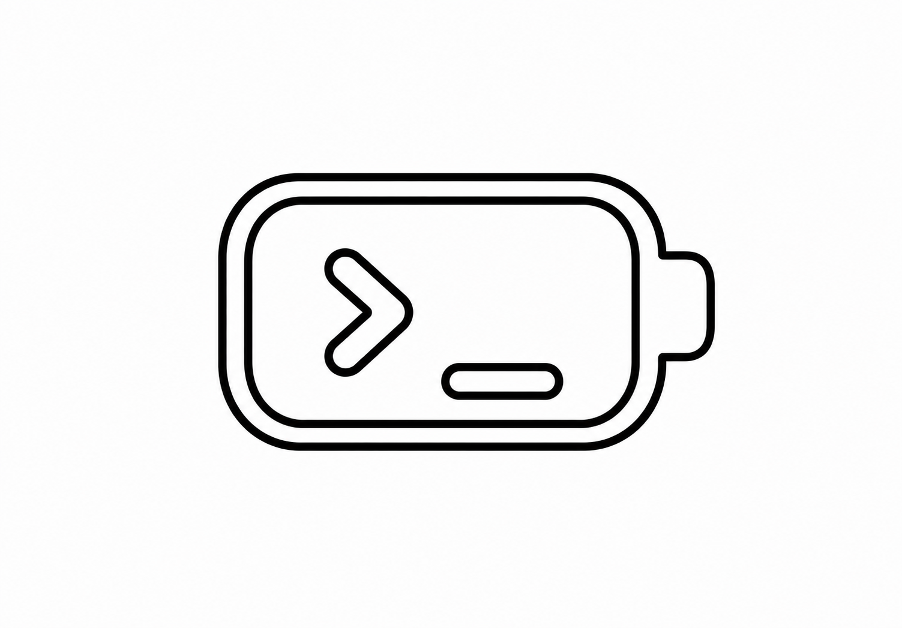

<p align="center">
  
</p>

<h1 align="center">Codex Usage Bar</h1>

<p align="center">
  A tiny macOS menu bar battery for Codex 5h / 7d remaining limits.
</p>

<p align="center">
  <a href="#english">English</a>
  ·
  <a href="#中文">中文</a>
</p>

<p align="center">
  <a href="https://github.com/xiangyixuan-k/codex-usage-bar/releases/latest">
    
  </a>
  <a href="https://github.com/xiangyixuan-k/codex-usage-bar/actions/workflows/ci.yml">
    
  </a>
  
  
  
</p>

<p align="center">
  <a href="https://github.com/xiangyixuan-k/codex-usage-bar/releases/latest"><b>Download latest release</b></a>
  ·
  <a href="#install">Install from source</a>
  ·
  <a href="#privacy">Privacy</a>
</p>

<p align="center">
  
</p>

---

## English

Codex Usage Bar is a small macOS menu bar app that shows your Codex remaining rate-limit percentage as an Apple-style battery icon.

It is designed to be boringly simple:

- Shows a compact battery in the macOS menu bar
- Reads Codex local response-header limits first
- Lets you choose whether the battery shows the 5h window, the 7d window, or the lower remaining value
- Falls back to model-matched session `rate_limits`
- Falls back again to local token estimation only when live limits are unavailable
- Never uploads usage data anywhere
- Does not read or upload `~/.codex/auth.json`

### Why It Is Accurate

Codex writes response headers such as `x-codex-primary-used-percent` and `x-codex-secondary-used-percent` into its local request log after authenticated requests. This app reads those local headers first, so a normal Codex login is enough.

It also checks the current model before using session `rate_limits`, which prevents a Spark snapshot from being shown as a GPT-5.5 limit.

### Install

Download the latest app bundle from:

[github.com/xiangyixuan-k/codex-usage-bar/releases/latest](https://github.com/xiangyixuan-k/codex-usage-bar/releases/latest)

Releases include both:

- `.dmg` for the easiest macOS install flow
- `.zip` if you prefer a plain archived app bundle

Or build from source:

```bash
git clone https://github.com/xiangyixuan-k/codex-usage-bar.git
cd codex-usage-bar
./scripts/package-app.sh
open "dist/Codex Usage Bar.app"
```

### Menu

The menu includes:

- Remaining percentage
- 5h and 7d windows when Codex provides both
- `Menu Bar Shows` selector:
  - `5h remaining`
  - `7d remaining`
  - `Lower of 5h / 7d`
- `Settings` window:
  - Language: English / Simplified Chinese
  - Menu bar display mode
- Refresh now
- Open settings file from Settings
- Open Codex
- Quit

### Configure

On first launch, the app creates:

```text
~/.codex-usage-bar/config.json
```

Example:

```json
{
  "codexHome" : "~/.codex",
  "criticalRemainingPercent" : 10,
  "customStateDatabasePaths" : [],
  "enableOfficialRateLimitSnapshots" : true,
  "includeArchivedSessionsFallback" : false,
  "language" : "english",
  "maxRateLimitSnapshotAgeMinutes" : 360,
  "period" : "monthly",
  "rateLimitDisplayWindow" : "mostConstrained",
  "refreshIntervalSeconds" : 30,
  "tokenBudget" : 300000000,
  "warningRemainingPercent" : 25
}
```

When `enableOfficialRateLimitSnapshots` is true, the menu bar uses Codex's local response-header limits first:

- `primary` is the shorter rate-limit window
- `secondary` is the longer rate-limit window
- `mostConstrained` shows whichever window has less remaining percentage

The `tokenBudget` setting is only used by the final local token estimator.

### CLI Snapshot

You can test the parser without opening the menu bar UI:

```bash
swift run CodexUsageBar --once
swift run CodexUsageBar --once --json
swift run CodexUsageBar --once --budget 2000000 --period monthly
```

### Privacy

The app reads local files under your configured Codex home. It parses Codex request headers from local logs, parses session lines that contain `rate_limits` as a fallback, queries token totals from the local SQLite state database only when needed, and never uploads any of that data.

It does not read `~/.codex/auth.json`.

### Development

```bash
./scripts/smoke-test.sh
swift build
./scripts/package-app.sh
```

The package script builds:

- `dist/CodexUsageBar-<version>.dmg`
- `dist/CodexUsageBar-<version>.zip`

### Limitations

- Live limits update when Codex writes a completed request log.
- If the value looks stale, send or complete one Codex request and refresh.
- The fallback local token estimate is not an official OpenAI quota meter.
- If Codex changes its local storage format, the app may need a parser update.

---

## 中文

Codex Usage Bar 是一个很小的 macOS 菜单栏工具，用电池图标显示 Codex 的剩余额度百分比。

它的设计目标是足够直观：

- 在 macOS 菜单栏显示一个短电池图标
- 优先读取 Codex 本地请求响应头里的真实额度
- 可以选择菜单栏电池显示 5 小时窗口、7 天窗口，或者二者中更低的剩余额度
- 如果没有实时响应头，再使用和当前模型匹配的 session `rate_limits`
- 最后才退回本地 token 估算
- 不上传任何使用数据
- 不读取、不上传 `~/.codex/auth.json`

### 为什么更准

Codex 在完成认证请求后，会把 `x-codex-primary-used-percent` 和 `x-codex-secondary-used-percent` 这类响应头写进本地请求日志。这个 app 会优先读取这些本地响应头，所以只要你正常登录过 Codex 就能用。

它也会先检查当前模型，再使用 session `rate_limits` 作为后备，避免把 Spark 的 100% 快照错显示成 GPT-5.5 的剩余额度。

### 安装

直接下载最新版：

[github.com/xiangyixuan-k/codex-usage-bar/releases/latest](https://github.com/xiangyixuan-k/codex-usage-bar/releases/latest)

发布包里会同时提供：

- `.dmg`，适合最简单的 macOS 安装流程
- `.zip`，适合直接解压 app bundle

也可以从源码构建：

```bash
git clone https://github.com/xiangyixuan-k/codex-usage-bar.git
cd codex-usage-bar
./scripts/package-app.sh
open "dist/Codex Usage Bar.app"
```

### 菜单

菜单里包含：

- 剩余额度百分比
- Codex 提供时显示 5 小时和 7 天两个窗口
- `Menu Bar Shows` 显示选项：
  - `5h remaining`
  - `7d remaining`
  - `Lower of 5h / 7d`
- `Settings / 设置` 窗口：
  - 语言：English / 简体中文
  - 菜单栏显示模式
- 立即刷新
- 在设置中打开配置文件
- 打开 Codex
- 退出

### 配置

首次启动后会创建：

```text
~/.codex-usage-bar/config.json
```

示例：

```json
{
  "codexHome" : "~/.codex",
  "criticalRemainingPercent" : 10,
  "customStateDatabasePaths" : [],
  "enableOfficialRateLimitSnapshots" : true,
  "includeArchivedSessionsFallback" : false,
  "language" : "english",
  "maxRateLimitSnapshotAgeMinutes" : 360,
  "period" : "monthly",
  "rateLimitDisplayWindow" : "mostConstrained",
  "refreshIntervalSeconds" : 30,
  "tokenBudget" : 300000000,
  "warningRemainingPercent" : 25
}
```

当 `enableOfficialRateLimitSnapshots` 为 true 时，菜单栏优先使用 Codex 本地响应头额度：

- `primary` 是较短的限额窗口
- `secondary` 是较长的限额窗口
- `mostConstrained` 显示剩余额度更低的窗口

`tokenBudget` 只在最终的本地 token 估算兜底里使用。

### 命令行快照

不打开菜单栏 UI，也可以测试解析结果：

```bash
swift run CodexUsageBar --once
swift run CodexUsageBar --once --json
swift run CodexUsageBar --once --budget 2000000 --period monthly
```

### 隐私

这个 app 只读取你配置的 Codex 本地目录。它会解析本地日志里的 Codex 响应头，把 session 中包含 `rate_limits` 的行作为后备，只在需要时查询本地 SQLite 里的 token 总量，并且不会上传这些数据。

它不会读取 `~/.codex/auth.json`。

### 开发

```bash
./scripts/smoke-test.sh
swift build
./scripts/package-app.sh
```

打包脚本会生成：

- `dist/CodexUsageBar-<version>.dmg`
- `dist/CodexUsageBar-<version>.zip`

### 限制

- 实时额度会在 Codex 写入完成请求日志后更新。
- 如果数字看起来滞后，完成一次 Codex 请求后手动刷新即可。
- 本地 token 估算不是官方 OpenAI 配额表。
- 如果 Codex 以后修改本地存储格式，这个 app 可能需要更新解析器。
